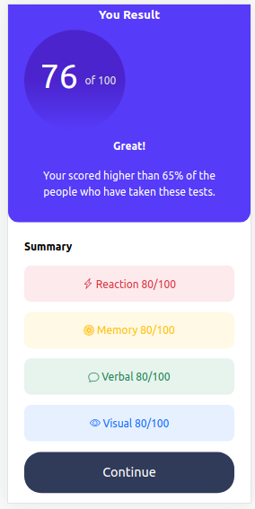
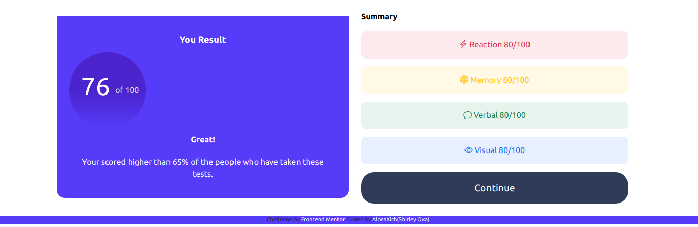

# Frontend Mentor - Results summary component solution

Esta es una solucion a [Results summary component challenge on Frontend Mentor](https://www.frontendmentor.io/challenges/results-summary-component-CE_K6s0maV). Los dsfios de Frontend Mentor ayudan a mejorar habilidades de codigo para construir proyectos reales. 

## Tabla de contenido

- [Frontend Mentor - Results summary component solution](#frontend-mentor---results-summary-component-solution)
  - [Tabla de contenido](#tabla-de-contenido)
  - [Descripcion general](#descripcion-general)
    - [El desafio](#el-desafio)
    - [Screenshot](#screenshot)
    - [Links](#links)
  - [Mi proceso](#mi-proceso)
    - [Construido con](#construido-con)
    - [Que aprendí](#que-aprendí)
    - [Desarrollo continuo](#desarrollo-continuo)
    - [Useful resources](#useful-resources)
  - [Author](#author)
  - [Acknowledgments](#acknowledgments)

**Note: Delete this note and update the table of contents based on what sections you keep.**

## Descripcion general

### El desafio

Los usuarios deberían poder:

- Ver el diseño óptimo para la interfaz según el tamaño de pantalla de su dispositivo
- Ver estados de desplazamiento y enfoque para todos los elementos interactivos en la página
  
### Screenshot

### Links

- Solution URL: [Add solution URL here](https://your-solution-url.com)
- Live Site URL: [Add live site URL here](https://your-live-site-url.com)

## Mi proceso

### Construido con

- Semantic HTML5 markup
- CSS custom properties
- Flexbox
- CSS Grid
- Mobile-first workflow
- [React](https://reactjs.org/) - JS library

### Que aprendí

### Desarrollo continuo

Use this section to outline areas that you want to continue focusing on in future projects. These could be concepts you're still not completely comfortable with or techniques you found useful that you want to refine and perfect.

**Note: Delete this note and the content within this section and replace with your own plans for continued development.**

### Useful resources

- [Example resource 1](https://www.example.com) - This helped me for XYZ reason. I really liked this pattern and will use it going forward.
- [Example resource 2](https://www.example.com) - This is an amazing article which helped me finally understand XYZ. I'd recommend it to anyone still learning this concept.

**Note: Delete this note and replace the list above with resources that helped you during the challenge. These could come in handy for anyone viewing your solution or for yourself when you look back on this project in the future.**

## Author

- Website - [Add your name here](https://www.your-site.com)
- Frontend Mentor - [@yourusername](https://www.frontendmentor.io/profile/yourusername)
- Twitter - [@yourusername](https://www.twitter.com/yourusername)

**Note: Delete this note and add/remove/edit lines above based on what links you'd like to share.**

## Acknowledgments

This is where you can give a hat tip to anyone who helped you out on this project. Perhaps you worked in a team or got some inspiration from someone else's solution. This is the perfect place to give them some credit.

**Note: Delete this note and edit this section's content as necessary. If you completed this challenge by yourself, feel free to delete this section entirely.**
